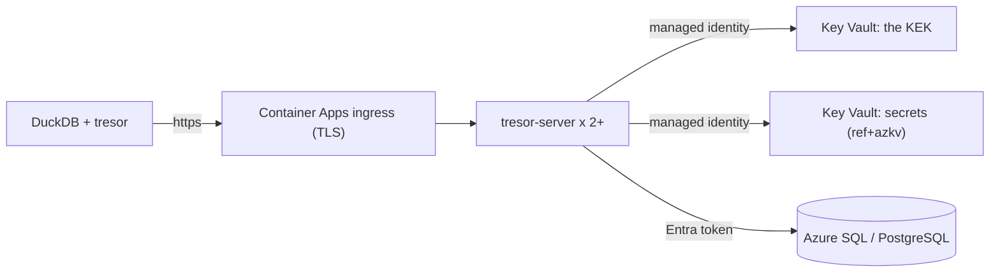

# Azure Container Apps

The repository's recipe, `deploy/azure-container-apps/main.bicep`, deploys the service with several replicas
and no password or secret of the service's own.



## What it creates

- **A user-assigned managed identity.** Everything the service reaches, it reaches as this identity.
- **A Key Vault** on the RBAC permission model, with purge protection:
  - the KEK, an RSA-3072 key. The identity has a custom role on it: get, wrap, unwrap, sign;
  - the secrets references may read. The identity is *Key Vault Secrets User* on the vault.
- **The database**, Entra authentication only, the identity its administrator:
  - `database=postgres`: Azure Database for PostgreSQL Flexible Server, Burstable B1ms;
  - `database=sqlserver`: Azure SQL, a Basic database. Not serverless: the readiness checks reach the
    database every 30 s and the purge every minute, so a serverless one would never pause.
- **Container Apps** with a Log Analytics workspace, and the app:
  - built-in ingress with TLS; the service runs with `tls.offload`;
  - two replicas or more;
  - probes on `/healthz` (liveness, startup) and `/readyz` (readiness).

The configuration is all `TRESOR_*` variables: nothing is mounted.

## Deploy

```bash
az group create -n tresor -l westeurope
az deployment group create -g tresor -f deploy/azure-container-apps/main.bicep \
  -p database=sqlserver \
  -p issuers="[{issuer: 'https://login.microsoftonline.com/<tenant>/v2.0', audience: '<api client id>', client_id: '<public client id>', scopes: [openid, offline_access, 'api://tresor/access_as_user'], human_flows: [authorization_code, device_code], service_flows: [client_credentials, private_key_jwt], roles_claim: roles, service: {claim: idtyp, equals: app, client_claim: azp}}]" \
  -p admins="[role:secrets_admin]"
```

The issuer is tresor's [Entra setup](https://hugr-lab.github.io/tresor/entra/): a v2 token's audience is the
API's client id. The outputs are the service's URL, the vault's name, the identity's client id and the
database's DSN. DuckDB attaches the URL:

```sql
ATTACH 'tresor:tresor-app.<environment>.westeurope.azurecontainerapps.io' AS corp;
```

| Parameter | Default | |
| --- | --- | --- |
| `database` | `postgres` | `postgres` or `sqlserver` |
| `issuers` | - | the identity providers (YAML) |
| `admins` | - | who manages secrets (principals) |
| `actors` | `[]` | the servers that act for users (duckdb-acl nodes) |
| `materialAllow` | this vault, `duckdb-*` | where references may read |
| `image` | `ghcr.io/hugr-lab/tresor-server:edge` | pin a release tag in production |
| `minReplicas`, `maxReplicas` | 2, 3 | |
| `prefix` | `tresor` | the resources' names: lower-case letters and digits, a letter first |
| `location` | the resource group's | |

## For production

The recipe is small on purpose. Tighten it:

- **Network**: the database and the vault take connections from Azure services. Put the environment in a
  VNet and reach them through private endpoints.
- **The database role**: rather than the identity as the server's administrator, an administrator of your
  own, and a role for the identity that owns only the `tresor` database.
- **Other vaults** in the allowlist: *Key Vault Secrets User* for the identity on each.
- **The KEK**: a rotation policy, then `rewrap` (below).
- **The image**: a version tag, not `edge`.
- **Minted secrets** (`token_exchange`): the service's client secret at the IdP as a Container Apps secret,
  in the variable the issuer's `exchange.client_secret_env` names.

## The commands as jobs

The recipe makes a manual Container Apps job per command, with the app's image, managed identity and settings
(spec 019): `<prefix>-reseal` (`reseal -retire`), `-reseal-rotate`, `-rewrap`, `-refs` (`refs -resolve`), `-mac`.

```sh
az containerapp job start -g <rg> -n tresor-reseal
az containerapp job execution list -g <rg> -n tresor-reseal -o table
```

Their logs go to the environment's Log Analytics. Whoever may start them acts as the service.

## Checked live

`scripts/dev/aca_live.sh up sqlserver` deploys the recipe and checks it from DuckDB with an Entra
application:

- it logs in with client credentials;
- it creates a secret and one by reference, and grants their use to its role;
- it finds both through DuckDB's lookup;
- four protocol fetches with the application's own token, through the ingress to the two replicas, each
  read the reference in Key Vault with the managed identity.
