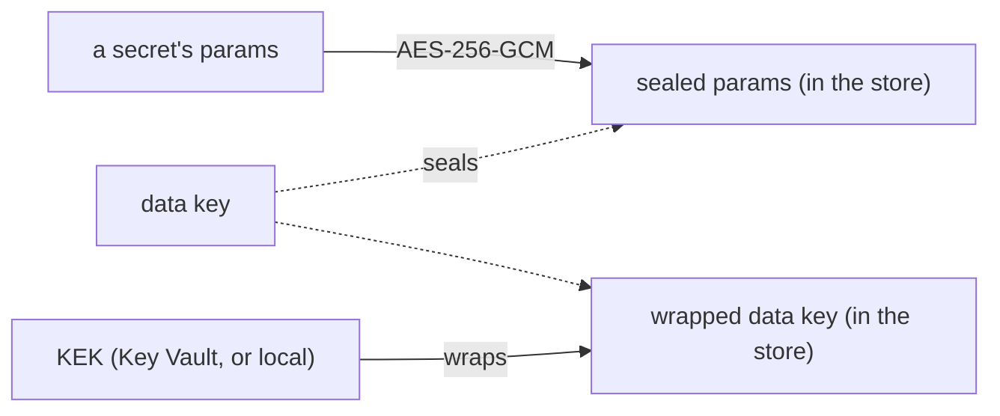

# Encryption

A secret's material is sealed before it reaches the state store: envelope encryption.



- **A secret's params** are one JSON document, sealed with AES-256-GCM under a data key.
- **The AAD** names the row, the secret's name and its version. A sealed value copied to another secret,
  another version, or kept from a dropped secret of the same name does not open.
- **A data key** is random, wrapped by the KEK, and stored wrapped. Unwrapped ones stay in memory for
  `keys.cache_ttl` (5 minutes), never written or logged.
- **A delegation grant's tokens** (the user's token, the tokens minted for them) are sealed the same way,
  bound to the grant.
- **A data key is authenticated**: a tag under the KEK's root (below). One planted by whoever could write
  the store is refused.
- **What does not open is an error**, never an empty value: a tampered value, a data key another KEK
  wrapped or one that is not authentic (`500 service_error`); a KEK that does not answer (`503`).

## The root

An RSA KEK wraps with its **public** key: anyone who has it can make a data key that unwraps, and seal
material of their choice under it. So a data key that unwraps proves nothing. The service derives a
**root** that only the KEK's holder can compute, and tags every data key with it:

| KEK | The root |
| --- | --- |
| Key Vault RSA | a deterministic signature (RS256) of a fixed label, made in the vault |
| Managed HSM AES | a deterministic wrap (A256KW) of a fixed label |
| local | HMAC-SHA256 of a fixed label under the key |
| OpenBao / Vault Transit | a Transit HMAC of a fixed label, at the KEK's version |

- The root is never stored; it stays in memory for `keys.cache_ttl`, as the data keys do.
- A data key's tag is an HMAC under the root over its id, its KEK id, its creation time and its wrapped
  bytes: no one who writes the store keeps a data key active past its age.
- A data key tagged by the first version of this (no creation time in the tag) still opens, but a new one
  is made for new values; `rewrap` tags it anew.
- A data key whose tag does not match is refused, on every store.
- **Upgrading from a version before this**: its data keys have no tag, and every value sealed under them is
  refused (`500`) until they are tagged. Once, at the upgrade, with the service's new version:
  1. Key Vault: give the KEK the `sign` operation (`az keyvault key set-attributes --vault-name <vault>
     --name <key> --ops wrapKey unwrapKey sign`, or rotate it with those operations), and the service's
     identity the custom role (get, wrap, unwrap, sign) on the key;
  2. `tresor-server rewrap -tag-untagged -config …`: it tags the data keys that have none - you vouch for
     the store as it is - and logs each one it tagged.
- **On the Kubernetes store**, what is not sealed (a secret's grants, a delegation grant's user) carries a
  MAC under a key derived from a data key: only the KEK's holder can make one that verifies. A `rewrap` keeps
  the data keys, so it keeps every MAC.
- A routine `rewrap` (after a rotation) never tags a data key with no tag: it skips and names it, for a key
  planted since would carry none either. It never tags a data key whose tag does not match.

## The KEK

### `local`

```yaml
keys: {kind: local, key_env: TRESOR_KEK}   # or key_file: /run/secrets/kek
```

32 bytes, base64 (`openssl rand -base64 32`). Data keys are wrapped with AES key wrap (RFC 3394). For
development, tests and small installs: the key is a static secret.

### `azurekeyvault`

```yaml
keys: {kind: azurekeyvault, key: https://corp-kv.vault.azure.net/keys/tresor-kek}
azure: {identity: managed}
```

- A key in Azure Key Vault or Managed HSM. The KEK never leaves it: the service asks it to wrap and unwrap.
- `RSA-OAEP-256` for an RSA key (either service); `A256KW` for an AES key on Managed HSM.
- The service's identity needs get, wrap, unwrap and **sign** on the key - sign makes the root. No
  built-in role gives exactly these four: the recipes make a custom role, on the one key. On Managed HSM
  (an AES key), *Managed HSM Crypto Service Encryption User* is enough: the root is a wrap.
- The vault on the RBAC permission model, with purge protection: the material depends on the key.
- The key is named **without a version**. New data keys are wrapped under its current version; each data
  key records the version it was wrapped under.
- The current version is read at most once a minute. While the vault does not answer, the last one read
  serves for up to an hour: a seal needs no vault when its data key is in memory.

### `vault`: OpenBao or HashiCorp Vault Transit

```yaml
keys: {kind: vault, mount: transit, key: tresor-kek}
vault:
  address: https://bao.example.eu:8200
  auth: {method: kubernetes, role: tresor-server}     # kubernetes | jwt | token_file
```

- **The key**: an `aes256-gcm96` (or `chacha20-poly1305`) Transit key, not derived. The KEK never leaves
  Vault; the service asks it to encrypt and decrypt data keys. Mounts are one path segment (`transit`, not
  `team/transit`).
- **The KEK id** is `vault:<mount>/<key>:v<N>`, the version the ciphertext names.
- **The root** is Transit's HMAC of a fixed label at that version. Every Transit key has an HMAC key per
  version. Whoever holds `hmac` on the key can compute the root, so:
  - give `hmac` on it to the service alone;
  - never make it `exportable` or `allow_plaintext_backup` (the service refuses such a key);
  - never set `min_encryption_version`: it refuses the HMAC at older versions (the service refuses that too).
    Retire versions with `min_decryption_version`.
- **The service's policy**, on that one key:

  ```hcl
  path "transit/encrypt/tresor-kek"  { capabilities = ["update"] }
  path "transit/decrypt/tresor-kek"  { capabilities = ["update"] }
  path "transit/hmac/tresor-kek/sha2-256" { capabilities = ["update"] }
  path "transit/keys/tresor-kek"     { capabilities = ["read"] }
  ```

- **Rotation**:
  1. `bao write -f transit/keys/tresor-kek/rotate`;
  2. `tresor-server rewrap`;
  3. raise the key's `min_decryption_version` to retire the old versions.
- **The login has no static secret**:
  - `kubernetes`: the pod's ServiceAccount token, against Vault's Kubernetes auth method;
  - `jwt`: a projected token (`jwt_file`), against its JWT auth method;
  - `token_file`: a token a Vault Agent writes and renews.
- **The token**: a login's is replaced at two thirds of its lease; when that login fails, the old token serves
  until its own end. A 403 with a live token (the policy's refusal) costs no login. A redirect from Vault is
  never followed: it would carry the token and a data key elsewhere. Give the role short-lived tokens
  (`token_type=batch` suits).

## Rotation

1. **Rotate the KEK in the vault** (by hand, or a rotation policy). The service sees the new version within
   a minute and makes a new data key for new values. Old values still open: their data keys name the old
   version.
2. **Rewrap**, to retire the old versions:

   ```bash
   tresor-server rewrap -config server.yaml
   ```

   Every data key is unwrapped under its old version and wrapped under the current one, compare-and-set.
   No sealed value is touched. It runs next to the service. It goes on past a data key it cannot rewrap,
   names each, and exits non-zero.
3. **Retire the old versions** in the vault once `rewrap` has passed.

Data keys also rotate by age: one older than `keys.data_key_max_age` (30 days) is replaced for new values.

## Resealing, and retiring data keys

A data key's rotation moves new writes only: a value written once stays under the data key of its day, and
every data key stays stored. `reseal` (spec 018) moves the rows to the active data key and deletes the data
keys nothing uses any more:

```bash
tresor-server reseal -config server.yaml                   # every row onto the active data key
tresor-server reseal -config server.yaml -rotate -retire   # a data key leaked: a new one, then the old ones deleted
```

- **Not a write**: each value is opened and sealed again under the same binding, its MAC made anew; its
  version, its times and its ETag stay. Every move is compare-and-set; it runs next to the service (on SQLite,
  with the service stopped).
- **Only what verifies moves**: a row whose MAC does not verify, or (a SQL store) has none yet - `tresor-server
  mac` first - is named and left, and the command exits non-zero.
- **Minted tokens on a SQL store stay** under their data key: the store keeps their key only hashed, and their
  binding names it. They go with their delegation grant, within hours; `-retire` keeps their data key until
  then. The Kubernetes store moves them too.
- **`-retire`** deletes a data key that is not the active one, was superseded more than `keys.cache_ttl` plus
  a minute ago (a replica may seal under one it still holds as active), and that no row uses. A row under a
  deleted data key is refused, never read as empty.
- **Backups** keep their own data keys: a leaked data key still opens a backup taken before.

## Moving to another KEK

From a local key to Key Vault or Vault, from one Key Vault key to another, from one Transit key (or mount) to
another on the same Vault server: the data keys are moved, the values stay as they are, and the service serves
throughout. Moving between two Vault servers is not supported: one `vault:` client serves every vault KEK.

1. **Both KEKs configured.** The new one is `keys`; the old one is listed under `keys.previous`, read only: data
   keys under it still unwrap, nothing new is wrapped with it. Deploy.

   ```yaml
   keys:
     kind: azurekeyvault
     key: https://corp-kv.vault.azure.net/keys/tresor-kek
     previous:
       - {kind: local, key_file: /var/run/tresor/kek-old/kek}
   ```

   New values go under a new data key wrapped by the new KEK. Readiness checks each previous KEK too, and the
   console's Service screen shows them.
2. **Move the data keys**, once the rollout has finished (a replica still on the old configuration would make
   new data keys under the old KEK):

   ```bash
   tresor-server rewrap -config server.yaml
   ```

   Every data key under a previous KEK is unwrapped with it and wrapped under the new one, its tag made under the
   new KEK's root. Run it until it moves none.
3. **Remove `keys.previous`**, deploy, then retire the old KEK (delete the local key's file and its Secret).

- A data key opens only with the KEK that owns its id - never by trying each. A data key left under a KEK that
  is no longer configured is refused (`500`), never read as empty.
- The same KEK as `keys` and in `keys.previous` is refused at start.
- Until step 3 the old KEK is trusted as the current one is: `rewrap` carries over every data key authentic
  under it.
- On the chart, `localKEK.previousSecretName` mounts the old local KEK and lists it in `keys.previous`.
