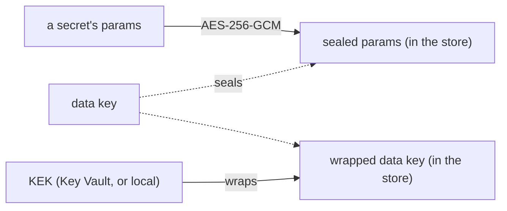

# Encryption

A secret's material is sealed before it reaches the state store: envelope encryption.



- **A secret's params** are one JSON document, sealed with AES-256-GCM under a data key.
- **The AAD** names the row, the secret's name and its version. A sealed value copied to another secret,
  another version, or kept from a dropped secret of the same name does not open.
- **A data key** is random, wrapped by the KEK, and stored wrapped. Unwrapped ones stay in memory for
  `keys.cache_ttl` (5 minutes), never written or logged.
- **A delegation grant's tokens** (the user's token, the tokens minted for them) are sealed the same way,
  bound to the grant.
- **What does not open is an error**, never an empty value: a tampered value, a data key another KEK
  wrapped, a KEK that does not answer.

## The KEK

### `local`

```yaml
keys: {kind: local, key_env: TRESOR_KEK}   # or key_file: /run/secrets/kek
```

32 bytes, base64 (`openssl rand -base64 32`). Data keys are wrapped with AES key wrap (RFC 3394). For
development, tests and small installs: the key is a static secret.

### `azurekeyvault`

```yaml
keys: {kind: azurekeyvault, key: https://corp-kv.vault.azure.net/keys/tresor-kek}
azure: {identity: managed}
```

- A key in Azure Key Vault or Managed HSM. The KEK never leaves it: the service asks it to wrap and unwrap.
- `RSA-OAEP-256` for an RSA key (either service); `A256KW` for an AES key on Managed HSM.
- The service's identity needs *Key Vault Crypto Service Encryption User* on the key (get, wrap, unwrap),
  and nothing more. On Managed HSM, its local role of the same name.
- The vault on the RBAC permission model, with purge protection: the material depends on the key.
- The key is named **without a version**. New data keys are wrapped under its current version; each data
  key records the version it was wrapped under.
- The current version is read at most once a minute. While the vault does not answer, the last one read
  serves for up to an hour: a seal needs no vault when its data key is in memory.

## Rotation

1. **Rotate the KEK in the vault** (by hand, or a rotation policy). The service sees the new version within
   a minute and makes a new data key for new values. Old values still open: their data keys name the old
   version.
2. **Rewrap**, to retire the old versions:

   ```bash
   tresor-server rewrap -config server.yaml
   ```

   Every data key is unwrapped under its old version and wrapped under the current one, compare-and-set.
   No sealed value is touched. It runs next to the service. It goes on past a data key it cannot rewrap,
   names each, and exits non-zero.
3. **Retire the old versions** in the vault once `rewrap` has passed.

Data keys also rotate by age: one older than `keys.data_key_max_age` (30 days) is replaced for new values.
