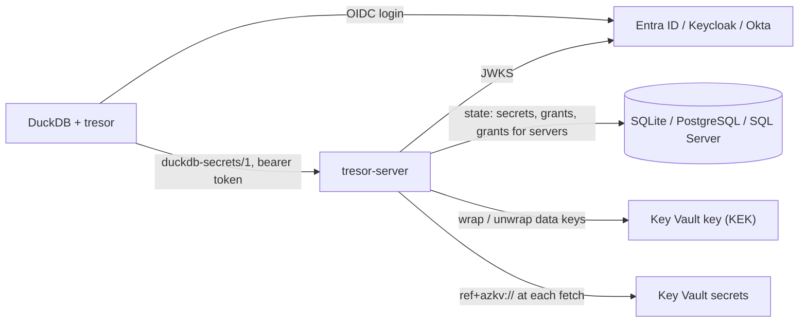

# tresor-server

tresor-server is the production service behind [tresor](https://hugr-lab.github.io/tresor/), the DuckDB
extension. DuckDB attaches it:

```sql
ATTACH 'tresor:secrets.corp.example' AS corp;
```

The attach logs DuckDB in through the organization's identity provider. From then on, the secrets the
caller's roles may use take part in DuckDB's own secret lookup.

The service speaks tresor's open protocol, [`duckdb-secrets/1`](https://hugr-lab.github.io/tresor/protocol/).
tresor's conformance suite runs against it in CI, on every state store.

## What it adds to tresor's reference server

tresor's reference server proves the protocol. It is one process with one encrypted file. tresor-server is
what an organization runs:

- **State in its database.** SQLite for one replica; PostgreSQL or SQL Server (Azure SQL) for several.
- **Material sealed under a KMS key.** The key-encryption key (KEK) stays in Azure Key Vault or Managed HSM;
  the service keeps only wrapped data keys.
- **Material left where it is.** A secret's parameter can be a reference, `ref+azkv://corp-vault/lake-s3`:
  the value stays in Azure Key Vault, and is read at each fetch. A rotation there reaches DuckDB at once.
- **No password of its own.** On Azure the service is a managed identity or a workload identity: Key Vault, Azure SQL and Azure
  Database for PostgreSQL log it in by Entra token.
- **One container.** A distroless image, and a recipe for Azure Container Apps.

## How it fits together



## Where to go next

- [Getting started](getting-started.md): the service on a laptop, then DuckDB against it.
- [Configuration](configuration.md): every setting, in a file or in the environment.
- [Azure Container Apps](azure-container-apps.md): a deployment with a database, Key Vault and a managed
  identity.
- [Security](security.md): what the service guarantees, and what it trusts.

## License

Business Source License 1.1. Production use is permitted, provided you do not offer tresor-server - or a
service whose value derives substantially from it - to third parties as a hosted or managed service. Each
version becomes Apache-2.0 four years after it is first published. See the
[LICENSE](https://github.com/hugr-lab/tresor-server/blob/main/LICENSE).
